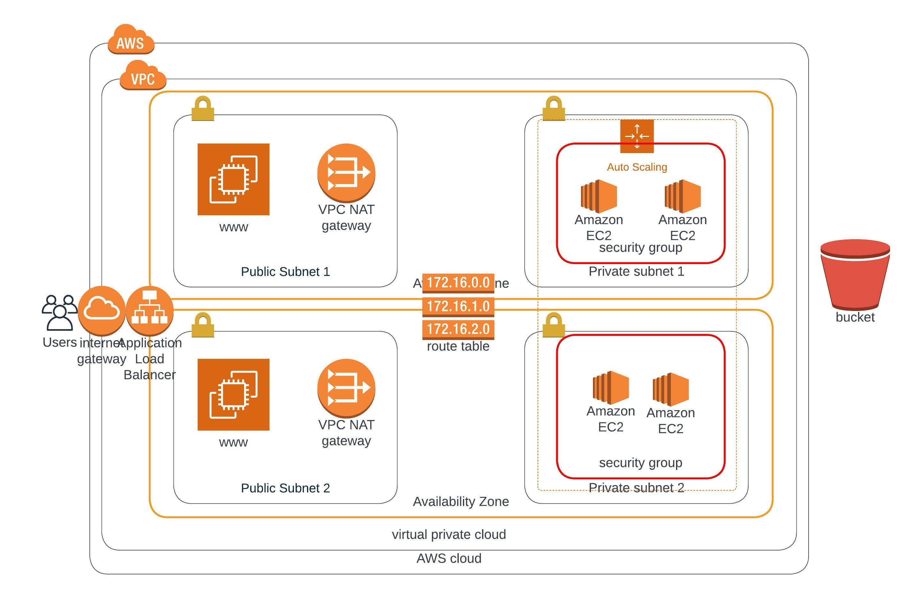

# Deploy A High Availability Web App Udacity AWS Engineer Project 2

## Infrastructure Diagram


## Create Bash Script
```bash
aws cloudformation create-stack --stack-name $1 --template-body file://$2  --parameters file://$3 --capabilities "CAPABILITY_IAM" "CAPABILITY_NAMED_IAM" --region=us-east-1
```

## Update Bash Script
```bash
aws cloudformation update-stack --stack-name $1 --template-body file://$2  --parameters file://$3 --capabilities "CAPABILITY_IAM" "CAPABILITY_NAMED_IAM" --region=us-east-1
```